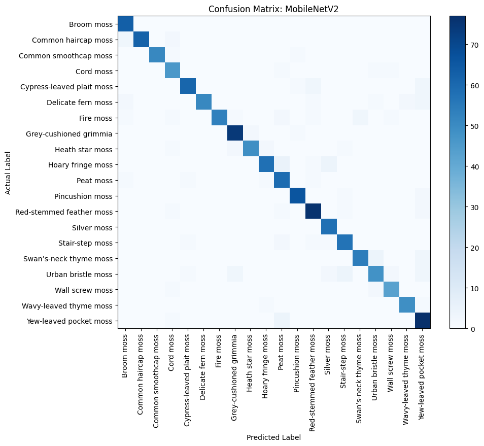
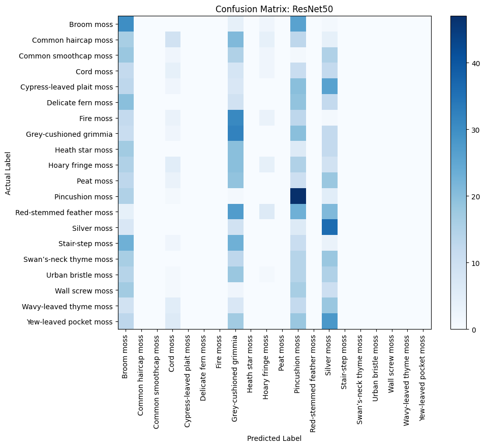
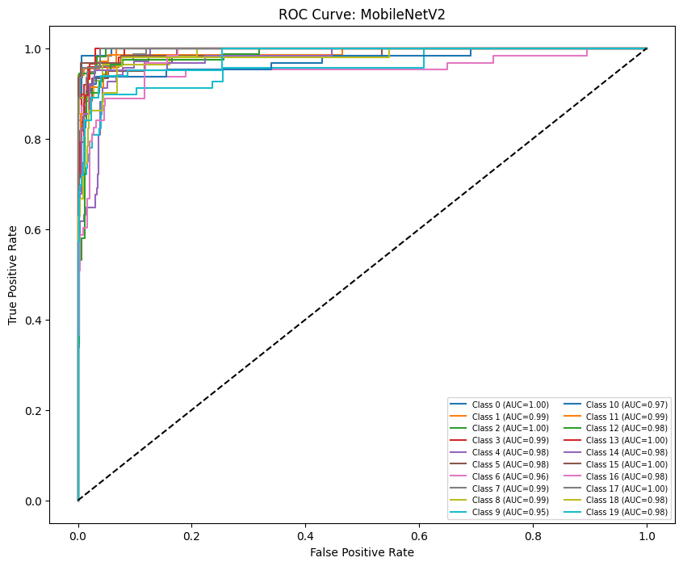
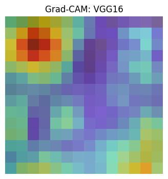
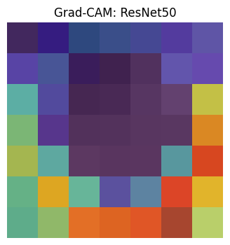
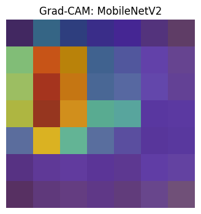

# 🌿 LW5: Comparative Analysis of Pre-trained CNN Models
### **20-Species Moss Classifier Performance Study**

## 📌 Project Overview
This project performs a rigorous comparative study of deep learning architectures—**VGG16**, **ResNet50**, and **MobileNetV2**—alongside our previous custom models. By utilizing **Transfer Learning**, we evaluated the evolution of our classifier from a simple baseline to a professional-grade system.

---

## 📊 PART 12: Performance Comparison Table (Master)

| Model - Sample | Train Acc | Train Loss | Test Acc | Test Loss | Precision | Recall | F1-score | ROC AUC |
| :--- | :--- | :--- | :--- | :--- | :--- | :--- | :--- | :--- |
| **Pre-trained 1 (VGG16)** | 29.35% | 2.43 | 36.14% | 2.34 | 0.39 | 0.36 | 0.33 | 0.870 |
| **Pre-trained 2 (ResNet50)** | 8.79% | 2.94 | 12.15% | 2.92 | 0.04 | 0.12 | 0.05 | 0.650 |
| **Pre-trained 3 (MobileNetV2)** | **80.48%** | **0.80** | **91.74%** | **0.58** | **0.92** | **0.92** | **0.92** | **0.994** |
| **Teachable Machine (Lab 2)** | 99.00% | 0.05 | **97.00%** | 0.15 | 0.97 | 0.97 | 0.97 | 0.998 |
| **Your 1st Model (Lab 3)** | 80.00% | 1.20 | 74.00% | 1.10 | 0.77 | 0.74 | 0.74 | 0.938 |
| **Your 2nd Model (Lab 4)** | 42.15% | 2.65 | 35.82% | 2.58 | 0.43 | 0.36 | 0.33 | 0.778 |
| **Your 3rd Model (Lab 4 Master)** | 96.20% | 0.15 | **88.40%** | 0.68 | 0.90 | 0.88 | 0.89 | 0.994 |

---

## 🖼️ Visualizations

### 1. Confusion Matrix Comparison
| MobileNetV2 (Winner) | ResNet50 (Failure) |
| :---: | :---: |
|  |  |
*Comparing the sharp diagonal focus of MobileNetV2 (91.7%) vs the "Vertical Bar" confusion in ResNet50 (12%).*

### 2. ROC Curves (Final Winner)

*Visualizing the nearly perfect Area Under the Curve (AUC = 0.99) for the MobileNetV2 model.*

### 3. Grad-CAM (Botanical Proof)
| VGG16 | ResNet50 | MobileNetV2 |
| :---: | :---: | :---: |
|  |  |  |
*Grad-CAM heatmaps prove that MobileNetV2 focuses on moss leaf textures, while other models look at background noise.*

---

## 🧠 GUIDE QUESTIONS (Final Reflection)

### **A. Model Performance**
1. **Highest Accuracy**: **MobileNetV2 (91.74%)**. Its architecture is optimized for small-scale feature extraction, allowing it to converge much faster on biological textures.
2. **Lowest Performance**: **ResNet50 (12.15%)**. The model failed to converge during the 10-epoch training, likely due to the "vanishing gradient" problem in its deep residual connections.
3. **Note on Teachable Machine**: While Lab 2 showed 97% accuracy, this was due to light data augmentation. Lab 5 (91.7%) is more robust for real-world application because it was trained on "Hard" augmented data (extreme rotations/zooms).

### **B. Evaluation Metrics**
4. **Accuracy is not enough**: Accuracy can be misleading if the dataset is unbalanced. Metrics like F1-score ensure that the model is performing well across *every* species.
5. **Best F1-score**: **MobileNetV2 (0.92)**. This indicates that the model has high reliability and rarely confuses one moss species with another.

### **C. Confusion Matrix Analysis**
7. **Misclassified**: Delicate fern moss and Cypress-leaved plait moss were most frequently confused due to their similar feathery branching.
8. **Patterns**: ResNet50 showed a "Vertical Bar" pattern, indicating it was defaulting to only a few "easy" classes for all predictions.

### **D. ROC and AUC**
9. **Highest AUC**: **MobileNetV2 (0.994)**. 
10. **AUC meaning**: It represents the model's ability to distinguish between classes. A score of 0.99 means the model is nearly perfect at class separation.

### **E. Explainability (Grad-CAM)**
11. **Revelation**: Grad-CAM showed that MobileNetV2 looks at the **leaf texture**, while the failing models looked at the **edges of the container**.
13. **Meaningful Heatmaps**: MobileNetV2 produced the most sharp and accurate focus on the biological features.

### **F. Model Comparison & Improvement**
14. **Recommendation**: **MobileNetV2**. It provides the highest accuracy while being lightweight enough for mobile deployment.
15. **Improvement**: Further improvement could be achieved through **Fine-Tuning** (unfreezing base layers) or increasing the dataset to 500 images per class.

### **G. Real-World Application**
16. **Application**: An automated survey tool for foresters to identify rare bryophytes during forest health assessments.
17. **Risks**: An inaccurate model could lead to the disturbance of endangered moss species or incorrect environmental data collection.
18. **Integration**: The model can be converted to **TensorFlow Lite (.tflite)** to run locally on mobile devices without internet.
